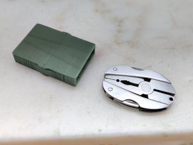
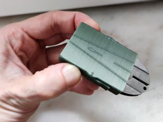
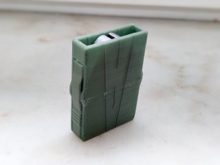

# Mammut Micro Tool case
*3D printable protective case for the Mammut Micro Tool*

### License
[Creative Commons - Attribution](https://creativecommons.org/licenses/by/4.0/)

### Gallery

[🔎](images/photo1.jpg) [🔎](images/photo2.jpg) [🔎](images/photo3.jpg)

## Description and Instructions

This is a protective case for the (older style) of the MAMMUT® Micro Tool, a tiny oval-shaped pair of foldable pliers featuring a few extra fold-out tools. I have made this case primarily because the tool on its own has a habit of folding open when stored in a backpack, and the stainless steel can also scratch other things. The case also makes it easier to find when printed in a bright colour.

The case is print-in-place and features built-in spring-loaded clamps that keep the tool inside. Press the lower sides of the case to open the clamps, and give it a light shake to get the tool out (see second photo). The case works best when the tool is inserted with plier jaws first. The lines on the outside act as a reminder for this.

If you have a chain or lanyard connected to your Micro Tool, the case does not offer room for this. It would be easy however to update the model with some cut-outs to allow for it.

I have noticed that there seems to be a new variation on this tool that has extra ‘flaps’ at the sides that seem to be meant to cover the fold-out tools. This case is made for the older version that does not have these ‘flaps’. It would need some size adjustments to fit this newer variant, but otherwise the design should stay the same. If you have this variant of the tool and feel like updating the 3D model and you don't fear editing something designed in Blender, the source file is included.

### Printing

The model was tweaked specifically to offer the right amount of ‘springiness’ when printed in PETG. I printed it at 0.15 mm layer resolution. It might work with other materials, but expect the springs to be pretty stiff if you print this in PLA.

The model relies on bridging to avoid the need for supports. Print it in the original orientation of the STL file. Your printer must be well-calibrated.

You may need to run a sharp blade through the gaps to liberate the springs from any stringing that may have occurred during printing.
